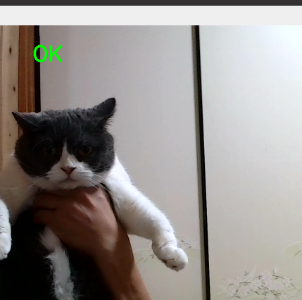
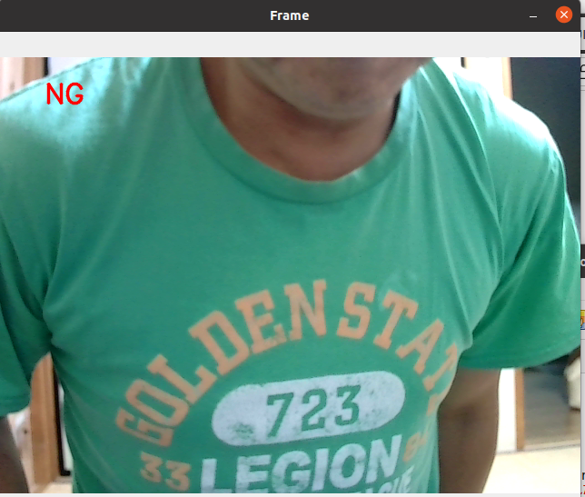

# attendance
attendance system home security


# Concept


# Explain of script
## script sub directory

## training_script.py
- It is traiing OK(known person/family/menmber)
- you can save the NG picture from original pics or datasets.

```
python training_script.py

```
- default epoch is 10. If you feel insufficient, you can adjust parameter.
### After training create and save model.pth file in the script directory.


## attendance.py
**This is main script recognize member**
- detected unknown person show "NG"

# OK directory 
## we can save approved person in this directory.

# NG direcotey
## we can save sample of Alian or non-relative person

# directory tree example

```

├── ng
│   └── ng
├── ok
│   ├── aiai
│   ├── fuku
│   ├── mama
│   └── youi
├── result
└── script

```

- NG directory is not necessary create sub directory
- OK directory is save memeber sub directory.


# Example 

## fuku (member of OK)


## NG (non registered or trained as NG)



